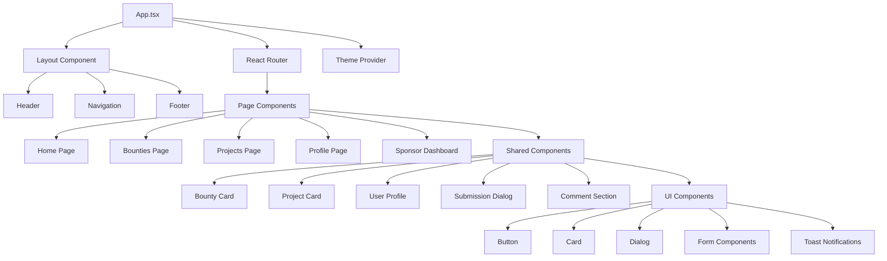
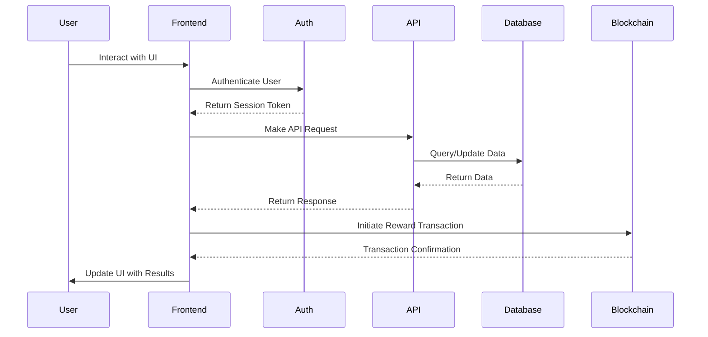
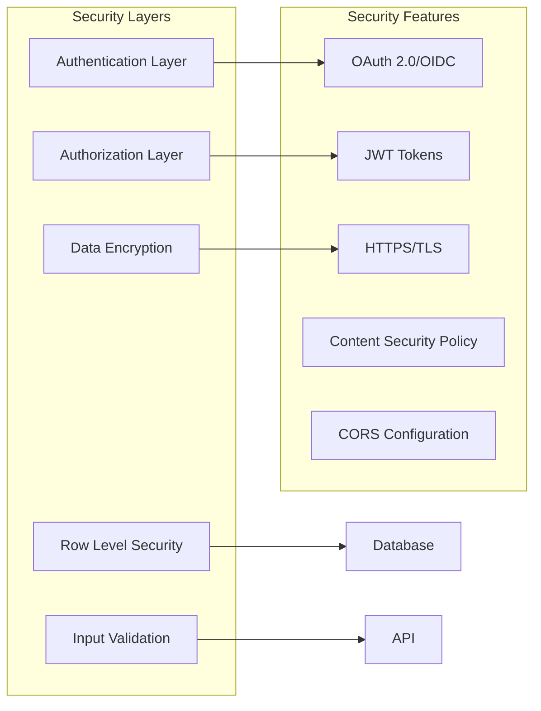
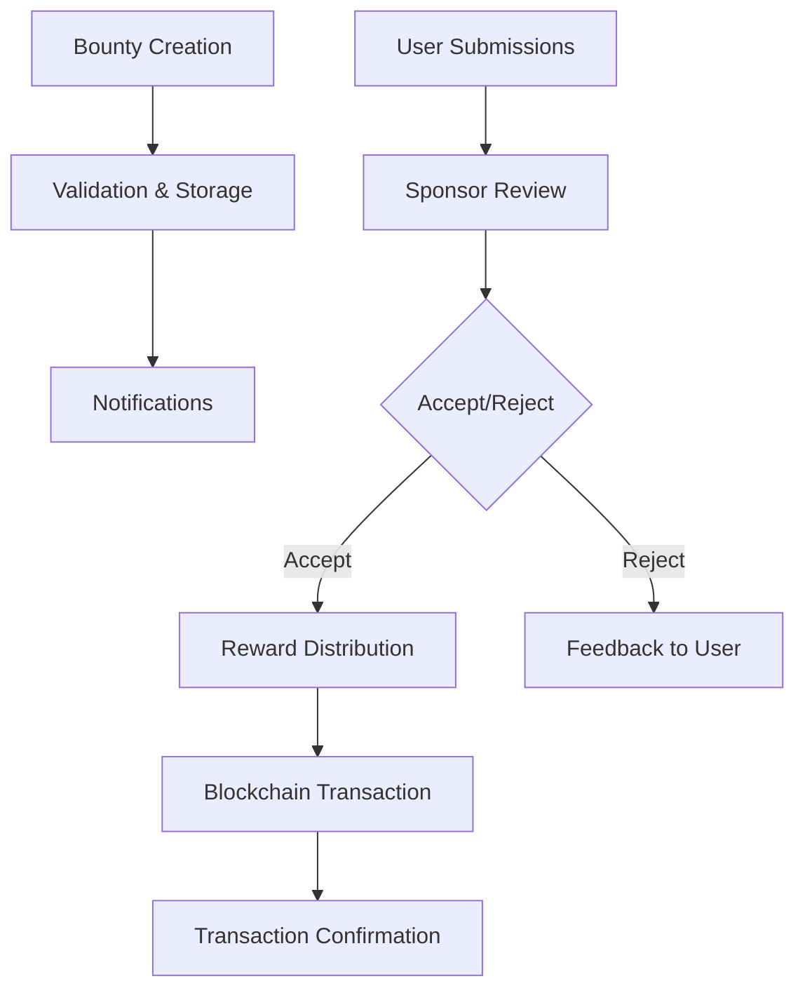
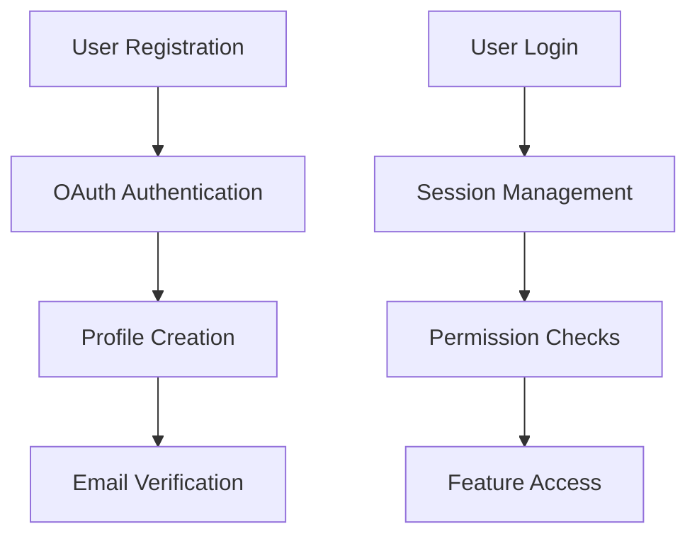

# Contribium Platform Architecture

## Overview

Contribium is a comprehensive bounty platform built on modern web technologies, utilizing React frontend, Supabase backend, and the Alephium blockchain for rewards distribution.

## Architecture Diagram

```mermaid
flowchart TB
    %% Frontend
    subgraph FE [Frontend Layer]
        UI[React Frontend]
        Components[Components]
        Styling[Styling]
        Navigation[Navigation]
        Pages[Pages]
        Hooks[Custom Hooks]
        Services[Service Layer]
        
        UI --> Components
        UI --> Styling
        UI --> Navigation
        Components --> Pages
        Components --> Hooks
        Components --> Services
    end

    %% Authentication
    subgraph AS [Authentication & State]
        Auth[Supabase Auth]
        OAuth[OAuth Providers]
        Google[Google]
        GitHub[GitHub]
        Context[React Context]
        UserCtx[User Context]
        SessionCtx[Session Context]
        ThemeCtx[Theme Context]
        
        Auth --> OAuth
        OAuth --> Google
        OAuth --> GitHub
        Auth --> Context
        Context --> UserCtx
        Context --> SessionCtx
        Context --> ThemeCtx
    end

    %% Backend
    subgraph BS [Backend Services]
        Supabase[Supabase Platform]
        Database[PostgreSQL]
        RLS[Row Level Security]
        Storage[File Storage]
        Realtime[Realtime Subscriptions]
        Edge[Edge Functions]
        
        Supabase --> Database
        Supabase --> RLS
        Supabase --> Storage
        Supabase --> Realtime
        Supabase --> Edge
    end

    %% Data Layer
    subgraph DL [Data Layer]
        Users[Users Table]
        Bounties[Bounties Table]
        Submissions[Submissions Table]
        Projects[Projects Table]
        Comments[Comments Table]
        Notifications[Notifications Table]
        Sponsors[Sponsors Table]
        Leaderboard[Leaderboard Views]

        Database --> Users
        Database --> Bounties
        Database --> Submissions
        Database --> Projects
        Database --> Comments
        Database --> Notifications
        Database --> Sponsors
        Database --> Leaderboard
    end

    %% External Services
    subgraph ES [External Services]
        Blockchain[Alephium Blockchain]
        Wallets[User Wallets]
        Rewards[Reward Distribution]
        CDN[Content Delivery Network]
        Analytics[Analytics Services]

        Blockchain --> Wallets
        Blockchain --> Rewards
    end

    %% Deployment
    subgraph DD [Dev & Deployment]
        Docker[Docker]
        CI[GitHub Actions]
        Staging[Staging]
        Prod[Production]

        CI --> Docker
        Docker --> Staging
        Docker --> Prod
    end

    %% Connections
    UI --> Auth
    Services --> Supabase
    Supabase --> Blockchain
    UI --> CDN

    %% Classes (optional: for Mermaid plugins)
    classDef frontend fill:#61dafb,stroke:#333,stroke-width:2px
    classDef backend fill:#3ecf8e,stroke:#333,stroke-width:2px
    classDef blockchain fill:#f39c12,stroke:#333,stroke-width:2px
    classDef infra fill:#9b59b6,stroke:#333,stroke-width:2px

    class UI,Components,Pages,Hooks frontend
    class Supabase,Database,RLS,Storage backend
    class Blockchain,Wallets,Rewards blockchain
    class Docker,CI,Staging,Prod infra
```

## Component Architecture

### Frontend Components

## Data Flow Architecture

## Security Architecture

## Technology Stack

### Frontend
- **Framework**: React 19 with TypeScript
- **Styling**: Tailwind CSS with custom theme system
- **UI Components**: Radix UI primitives
- **State Management**: React Context + Zustand
- **Routing**: React Router v7
- **Build Tool**: Vite
- **Testing**: Vitest + Testing Library

### Backend
- **Platform**: Supabase (PostgreSQL + Auth + Storage + Real-time)
- **Database**: PostgreSQL with Row Level Security
- **Authentication**: Supabase Auth with OAuth providers
- **File Storage**: Supabase Storage
- **Real-time**: Supabase Real-time subscriptions

### Blockchain
- **Network**: Alephium Blockchain
- **Wallet Integration**: Web3 wallet connections
- **Smart Contracts**: Reward distribution contracts

### Infrastructure
- **Containerization**: Docker
- **CI/CD**: GitHub Actions
- **Hosting**: Production deployment on custom domain
- **CDN**: Integrated content delivery

## Key Features Architecture

### Bounty System

### User Management

## Performance Considerations

- **Code Splitting**: Route-based and component-based code splitting
- **Lazy Loading**: On-demand component loading
- **Caching**: Supabase built-in caching + React Query for client-side caching
- **Real-time Updates**: Selective real-time subscriptions
- **Image Optimization**: Optimized image loading and CDN delivery

## Scalability Features

- **Database Indexing**: Optimized database queries with proper indexing
- **Connection Pooling**: Supabase connection management
- **Edge Functions**: Serverless functions for complex operations
- **Horizontal Scaling**: Supabase auto-scaling capabilities
- **CDN Distribution**: Global content distribution