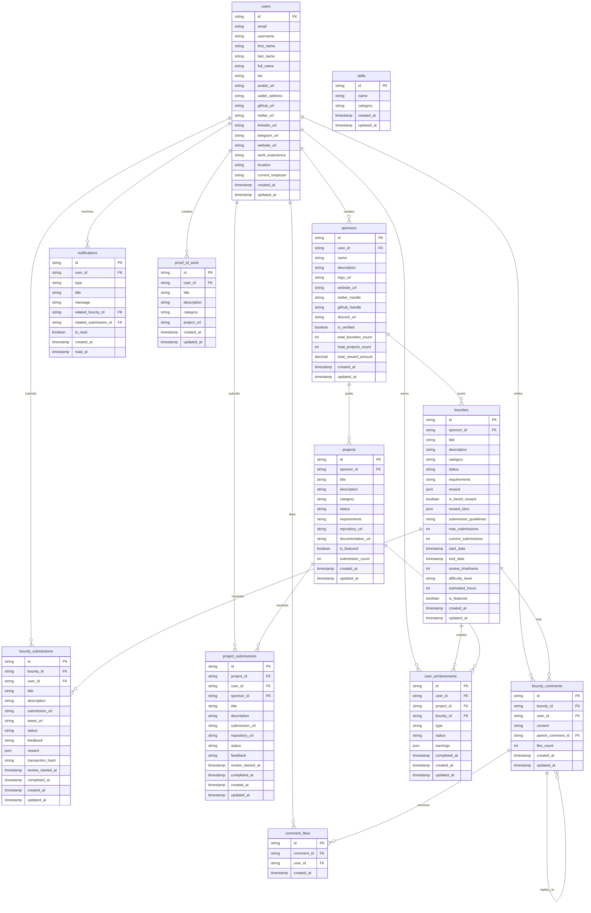

# Contribium Database Schema & Relationships

## Database Overview

Contribium uses PostgreSQL through Supabase with Row Level Security (RLS) enabled for all tables. The schema is designed to support a comprehensive bounty platform with user management, sponsor organizations, bounty/project management, and reward distribution.

## Entity Relationship Diagram



## Core Tables

### Users Table
Central user management with comprehensive profile information including skills, social links, and wallet integration.

```sql
CREATE TABLE users (
    id UUID PRIMARY KEY DEFAULT gen_random_uuid(),
    email TEXT UNIQUE NOT NULL,
    username TEXT UNIQUE,
    first_name TEXT,
    last_name TEXT,
    full_name TEXT,
    bio TEXT,
    avatar_url TEXT,
    wallet_address TEXT UNIQUE,
    github_url TEXT,
    twitter_url TEXT,
    linkedin_url TEXT,
    telegram_url TEXT,
    website_url TEXT,
    web3_interests TEXT[],
    work_experience TEXT CHECK (work_experience IN ('0-2', '2-5', '5-10', '10+')),
    location TEXT,
    current_employer TEXT,
    frontend_skills TEXT[],
    backend_skills TEXT[],
    blockchain_skills TEXT[],
    design_skills TEXT[],
    content_skills TEXT[],
    created_at TIMESTAMP WITH TIME ZONE DEFAULT NOW(),
    updated_at TIMESTAMP WITH TIME ZONE DEFAULT NOW()
);
```

### Sponsors Table
Organization/sponsor profiles with verification status and metrics tracking.

```sql
CREATE TABLE sponsors (
    id UUID PRIMARY KEY DEFAULT gen_random_uuid(),
    user_id UUID REFERENCES users(id) ON DELETE CASCADE,
    name TEXT NOT NULL,
    description TEXT,
    logo_url TEXT,
    profile_photos TEXT[],
    website_url TEXT,
    twitter_handle TEXT,
    github_handle TEXT,
    discord_url TEXT,
    is_verified BOOLEAN DEFAULT FALSE,
    total_bounties_count INTEGER DEFAULT 0,
    total_projects_count INTEGER DEFAULT 0,
    total_reward_amount DECIMAL(18,8) DEFAULT 0,
    created_at TIMESTAMP WITH TIME ZONE DEFAULT NOW(),
    updated_at TIMESTAMP WITH TIME ZONE DEFAULT NOW()
);
```

### Bounties Table
Bounty management with tiered rewards, submission tracking, and comprehensive metadata.

```sql
CREATE TABLE bounties (
    id UUID PRIMARY KEY DEFAULT gen_random_uuid(),
    sponsor_id UUID REFERENCES sponsors(id) ON DELETE CASCADE,
    title TEXT NOT NULL,
    description TEXT,
    category TEXT CHECK (category IN ('content', 'design', 'development', 'other')),
    status TEXT CHECK (status IN ('open', 'completed')) DEFAULT 'open',
    requirements TEXT,
    reward JSONB NOT NULL, -- {amount, token, usd_equivalent}
    is_tiered_reward BOOLEAN DEFAULT FALSE,
    reward_tiers JSONB, -- [{position, amount, token, usd_equivalent}]
    submission_guidelines TEXT,
    max_submissions INTEGER DEFAULT 1,
    current_submissions INTEGER DEFAULT 0,
    start_date TIMESTAMP WITH TIME ZONE DEFAULT NOW(),
    end_date TIMESTAMP WITH TIME ZONE,
    review_timeframe INTEGER DEFAULT 7, -- Days to review
    difficulty_level TEXT CHECK (difficulty_level IN ('beginner', 'intermediate', 'advanced')),
    estimated_hours INTEGER,
    tags TEXT[],
    is_featured BOOLEAN DEFAULT FALSE,
    created_at TIMESTAMP WITH TIME ZONE DEFAULT NOW(),
    updated_at TIMESTAMP WITH TIME ZONE DEFAULT NOW()
);
```

## Submission System

### Bounty Submissions
Comprehensive submission tracking with reward information and review workflow.

```sql
CREATE TABLE bounty_submissions (
    id UUID PRIMARY KEY DEFAULT gen_random_uuid(),
    bounty_id UUID REFERENCES bounties(id) ON DELETE CASCADE,
    user_id UUID REFERENCES users(id) ON DELETE CASCADE,
    title TEXT NOT NULL,
    description TEXT NOT NULL,
    submission_url TEXT NOT NULL,
    tweet_url TEXT,
    status TEXT CHECK (status IN ('submitted', 'accepted', 'rejected')) DEFAULT 'submitted',
    feedback TEXT,
    reward JSONB, -- {amount, token, usd_equivalent}
    transaction_hash TEXT,
    review_started_at TIMESTAMP WITH TIME ZONE,
    completed_at TIMESTAMP WITH TIME ZONE,
    created_at TIMESTAMP WITH TIME ZONE DEFAULT NOW(),
    updated_at TIMESTAMP WITH TIME ZONE DEFAULT NOW()
);
```

### Project Submissions
Similar structure for project-based submissions.

```sql
CREATE TABLE project_submissions (
    id UUID PRIMARY KEY DEFAULT gen_random_uuid(),
    project_id UUID REFERENCES projects(id) ON DELETE CASCADE,
    user_id UUID REFERENCES users(id) ON DELETE CASCADE,
    sponsor_id UUID REFERENCES sponsors(id) ON DELETE CASCADE,
    title TEXT NOT NULL,
    description TEXT NOT NULL,
    submission_url TEXT NOT NULL,
    repository_url TEXT,
    status TEXT CHECK (status IN ('submitted', 'accepted', 'rejected')) DEFAULT 'submitted',
    feedback TEXT,
    review_started_at TIMESTAMP WITH TIME ZONE,
    completed_at TIMESTAMP WITH TIME ZONE,
    created_at TIMESTAMP WITH TIME ZONE DEFAULT NOW(),
    updated_at TIMESTAMP WITH TIME ZONE DEFAULT NOW()
);
```

## Engagement Features

### Comment System
Hierarchical comment system with likes and reply threading.

```sql
CREATE TABLE bounty_comments (
    id UUID PRIMARY KEY DEFAULT gen_random_uuid(),
    bounty_id UUID REFERENCES bounties(id) ON DELETE CASCADE,
    user_id UUID REFERENCES users(id) ON DELETE CASCADE,
    content TEXT NOT NULL,
    parent_comment_id UUID REFERENCES bounty_comments(id) ON DELETE CASCADE,
    like_count INTEGER DEFAULT 0,
    created_at TIMESTAMP WITH TIME ZONE DEFAULT NOW(),
    updated_at TIMESTAMP WITH TIME ZONE DEFAULT NOW()
);

CREATE TABLE comment_likes (
    id UUID PRIMARY KEY DEFAULT gen_random_uuid(),
    comment_id UUID REFERENCES bounty_comments(id) ON DELETE CASCADE,
    user_id UUID REFERENCES users(id) ON DELETE CASCADE,
    created_at TIMESTAMP WITH TIME ZONE DEFAULT NOW(),
    UNIQUE(comment_id, user_id)
);
```

### Notification System
Comprehensive notification system for platform events.

```sql
CREATE TABLE notifications (
    id UUID PRIMARY KEY DEFAULT gen_random_uuid(),
    user_id UUID REFERENCES users(id) ON DELETE CASCADE,
    type TEXT CHECK (type IN ('submission_accepted', 'submission_rejected', 'bounty_completed', 'comment_reply', 'general')),
    title TEXT NOT NULL,
    message TEXT NOT NULL,
    related_bounty_id UUID REFERENCES bounties(id) ON DELETE SET NULL,
    related_submission_id UUID REFERENCES bounty_submissions(id) ON DELETE SET NULL,
    is_read BOOLEAN DEFAULT FALSE,
    created_at TIMESTAMP WITH TIME ZONE DEFAULT NOW(),
    read_at TIMESTAMP WITH TIME ZONE
);
```

## Achievement & Gamification

### User Achievements
Track user accomplishments across different activity types.

```sql
CREATE TABLE user_achievements (
    id UUID PRIMARY KEY DEFAULT gen_random_uuid(),
    user_id UUID REFERENCES users(id) ON DELETE CASCADE,
    project_id UUID REFERENCES projects(id) ON DELETE SET NULL,
    bounty_id UUID REFERENCES bounties(id) ON DELETE SET NULL,
    type TEXT CHECK (type IN ('project', 'bounty', 'grant', 'hackathon')),
    status TEXT CHECK (status IN ('open', 'completed')),
    earnings JSONB, -- {amount, token, Prize}
    completed_at TIMESTAMP WITH TIME ZONE,
    created_at TIMESTAMP WITH TIME ZONE DEFAULT NOW(),
    updated_at TIMESTAMP WITH TIME ZONE DEFAULT NOW()
);
```

### Proof of Work
Portfolio/showcase functionality for users.

```sql
CREATE TABLE proof_of_work (
    id UUID PRIMARY KEY DEFAULT gen_random_uuid(),
    user_id UUID REFERENCES users(id) ON DELETE CASCADE,
    title TEXT NOT NULL,
    description TEXT NOT NULL,
    category TEXT CHECK (category IN ('frontend', 'backend', 'blockchain', 'design', 'content')),
    skills TEXT[],
    project_url TEXT NOT NULL,
    created_at TIMESTAMP WITH TIME ZONE DEFAULT NOW(),
    updated_at TIMESTAMP WITH TIME ZONE DEFAULT NOW()
);
```

## Database Functions & Triggers

### Automatic Count Updates
Database functions to maintain accurate counts and metrics.

```sql
-- Function to update bounty submission count
CREATE OR REPLACE FUNCTION update_bounty_submission_count()
RETURNS TRIGGER AS $$
BEGIN
    UPDATE bounties 
    SET current_submissions = (
        SELECT COUNT(*) FROM bounty_submissions 
        WHERE bounty_id = COALESCE(NEW.bounty_id, OLD.bounty_id)
    )
    WHERE id = COALESCE(NEW.bounty_id, OLD.bounty_id);
    
    RETURN COALESCE(NEW, OLD);
END;
$$ LANGUAGE plpgsql;

-- Trigger for submission count updates
CREATE TRIGGER trigger_update_submission_count
    AFTER INSERT OR DELETE ON bounty_submissions
    FOR EACH ROW EXECUTE FUNCTION update_bounty_submission_count();
```

### Comment Like Count Updates
```sql
-- Function to update comment like count
CREATE OR REPLACE FUNCTION update_comment_like_count()
RETURNS TRIGGER AS $$
BEGIN
    UPDATE bounty_comments 
    SET like_count = (
        SELECT COUNT(*) FROM comment_likes 
        WHERE comment_id = COALESCE(NEW.comment_id, OLD.comment_id)
    )
    WHERE id = COALESCE(NEW.comment_id, OLD.comment_id);
    
    RETURN COALESCE(NEW, OLD);
END;
$$ LANGUAGE plpgsql;
```

## Security & Access Control

### Row Level Security (RLS)
All tables implement Row Level Security policies:

1. **Users**: Can read all profiles, update only their own
2. **Sponsors**: Can read all, update only their own organization
3. **Bounties**: Can read all, sponsors can manage their own
4. **Submissions**: Users can read relevant submissions, manage their own
5. **Comments**: Can read all, manage their own comments
6. **Notifications**: Users can only access their own notifications

### Database Indexes
Optimized indexes for common query patterns:

```sql
-- User lookup indexes
CREATE INDEX idx_users_username ON users(username);
CREATE INDEX idx_users_email ON users(email);
CREATE INDEX idx_users_wallet ON users(wallet_address);

-- Bounty query indexes
CREATE INDEX idx_bounties_status ON bounties(status);
CREATE INDEX idx_bounties_category ON bounties(category);
CREATE INDEX idx_bounties_sponsor ON bounties(sponsor_id);
CREATE INDEX idx_bounties_featured ON bounties(is_featured, created_at);

-- Submission indexes
CREATE INDEX idx_submissions_bounty ON bounty_submissions(bounty_id);
CREATE INDEX idx_submissions_user ON bounty_submissions(user_id);
CREATE INDEX idx_submissions_status ON bounty_submissions(status);

-- Comment system indexes
CREATE INDEX idx_comments_bounty ON bounty_comments(bounty_id);
CREATE INDEX idx_comments_parent ON bounty_comments(parent_comment_id);
CREATE INDEX idx_comment_likes_user ON comment_likes(user_id);
```

## Data Relationships Summary

1. **Users → Sponsors**: One-to-many (users can create multiple sponsor organizations)
2. **Sponsors → Bounties/Projects**: One-to-many (sponsors can post multiple bounties/projects)
3. **Bounties → Submissions**: One-to-many (bounties can receive multiple submissions)
4. **Users → Submissions**: One-to-many (users can submit to multiple bounties)
5. **Bounties → Comments**: One-to-many (bounties can have multiple comments)
6. **Comments → Likes**: One-to-many (comments can be liked by multiple users)
7. **Users → Achievements**: One-to-many (users can earn multiple achievements)
8. **Users → Notifications**: One-to-many (users receive multiple notifications)